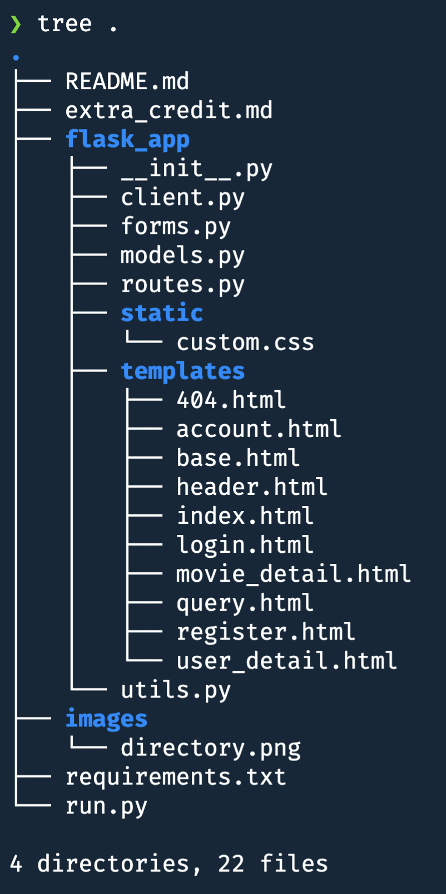

# P4: Movie Ratings Database Pro Max Plus S

**Assigned**: Week 6, March 2nd, 2022

**Due**: Week 8, March 15th, 2022, 11:59 PM

**Late Deadline**: Refer to syllabus for the policy.

## Description

You will be creating forms, view functions, and finishing templates for adding 
an account system to the project 3 app. For this website, users will have to 
be logged in in order to add comments. Also, we can see all the comments
made by each user by going to their user-detail page.

There will be two opportunities for extra credit: making 
the layout of the project nicer, and just adding more features to the website in general.

## Setup

The setup of the API key should be complete from project 3.

Activate your virtual environment
Then, to install the necessary packages, run `pip install -r requirements.txt`.

This week we'll be using the 
- `requests`
- `Flask`
- `Flask-MongoEngine` (with `Pillow`)
- `Flask-WTF`
- `Flask-Bcrypt`
- `Flask-Login`
- `python-dotenv`
libraries

## Project

This is the `p4/` directory structure

To run this project, stay in the `p4/` directory and use the `flask run`
command. The file that is run is `run.py`. It simply imports the `app` object
from the `flask_app/` package. The reason we have this new structure is to
avoid the problem of circular imports in Python projects.

The initialization of the `app` object and the other libraries happens in 
`__init__.py`. All of the view functions are in `routes.py`. The
database models are in `models.py`, and the `MovieClient` class
is now in `client.py`. The `current_time()` function you used
in the last project is now in `utils.py`, and it's been imported
into `routes.py` for your convenience. Forms are still in `forms.py`.

**Make sure to set the secret key in 
`__init__.py`!!!**

### routes.py

There are five new template files, corresponding to five
new view functions
in `routes.py`.

- `account.html`
- `login.html`
- `register.html`
- `user_detail.html`
- `404.html`

Now we'll go into detail about each of the new view functions:
1. `account()` - Login required
   Should be routed at `/account`. Renders the `account.html` template.
   The template has spaces for a greeting to the user, a
   username update form, a profile picture update form, and a link
   to see all of the current user's reviews.

   In the `account()` view function, make sure you create the username
   update form, properly modify the current user's username permanently
   if they change it to a name that's not taken
   (commit change to database). 

   For the greeting, you can choose how to greet the current user. It should
   use the current user's username to greet them. (**Hint:** the current user
   object is available in every template). 
   
   Also, display the current user's 
   profile picture. The forms
   should be rendered using Bootstrap classes. You can see an example of
   how we did that in `movie_detail.html`. 

   If they do not have a profile picture, **that's okay**. A
   profile picture
   is not required for every user.
   Make sure the profile picture
   updating form works whether
   or not the user has an existing
   profile picture or not.
   
   There should be a link to all of the current
   user's reviews, pointing to the user detail page
   of the current user.
2. `login()`
   Should be routed at `/login`. Renders the `login.html` template.
   The template has spaces for adding a message to the user telling
   them to register (if they don't have an account), for displaying
   a login form, and for showing flashed messages (messages created with
   `flash()` function). 

   For the `login()` view function, redirect the user away from the page
   if they're already authenticated (they don't need to see the login page, then).
   Add the LoginForm and properly authenticate the user. If they're **not** 
   successfully authenticated, ask the user to login again (don't give them
   hints whether the username or password was wrong).
   If they are successfully authenticated, redirect to their `/account` page.

   In `login.html`, ask the user to register if they don't have an account
   (and provide the link for them to do so),
   and display flashed messages, the login form, and any login form errors
   rendered with Bootstrap classes. 
3. `register()`
   Should be routed at `/register`. Renders the `register.html` template.
   The template has spaces for asking the user to login if they already have
   an account, for showing the registration form, and for showing flashed
   messages.

   For the `register()` view function, redirect the user away from the page 
   if they're already authenticated. Add the RegistrationForm and create
   the new account for the user if the form is validated (make sure to
   store hashed passwords, not plaintext). If any errors occur with registration, 
   display the error message to the user.
   If successfully registered, redirect the user to the `/login` page.

   In `register.html`, ask the user to login if they already have an account, and
   provide the link for them to do so, display any messages you want flashed, 
   and display the registration form, all rendered with Bootstrap.
4. `user_detail(username)`
   Should be routed at `/user/<username>`. Renders the `user_detail.html` template.
   The template has a space for indicating whose reviews we're looking at,
   a space for showing
   their profile picture,
   a space for displaying 
   all reviews, and a space for showing any errors.

   In the `user_detail()` view function, if the specified user exists, then
   render all of the reviews written by that user. If they don't exist, 
   display an error message. 

   In `user_detail.html`, indicate which user's reviews we're looking at. This
   is best done with their username. Then under that, display all of the reviews
   they've made. You should indicate how many reviews the specified user has made 
   in total, and then for each review show:
   - When the review was created
   - Which movie the review was made for (movie title)
   - The review content itself.
   Your template should be able to handle a variable number of reviews.
5. `logout()` - Login required
   Should be routed at `/logout`. Doesn't render a template, but
   logs out the current user. Redirect to the `/index` after
   logging out.
6. `movie_detail()`
   On the `movie_detail()` page, where users can enter reviews, show each commenter's
   profile picture next to their review. Notice that to get the profile picture associated
   with the reviewer for each review, we call `{{ review.image }}`. We thought this was
   the simplest way to implement our solution. After retrieving the correct reviews
   from Mongo, we just added an `image` item and passed it to the template.
   **You are allowed** to change this implementation.
7. `custom_404()`
   Add a custom 404 page. The barebones `custom_404()` function is provided. You
   should add the necessary decorators and other functionality to
   this function in order render a custom 404 page. You have
   to add the HTML/Jinja code to create the custom page. It **must** include the
   website header, a message informing the user about the 404 error, and include
   a link back to the index page.

Additionally, for each view function for which we indicated **login required**,
use the `login_required()` decorator from `Flask-Login`.

### Profile pics

To show user's profile pictures, we added the HTML/CSS code necessary to make the
profile pictures render nicely. You just have to:
- Supply the base64-encoded images to `render_template` in the way the template expects
  them. If you so wish, **you may modify** templates if you think it will make your
  implementation simpler.

### forms.py

In `forms.py`, we've included the code for the `RegistrationForm`
since we already discussed the implementation in class. We modified
the `MovieReviewForm` since users no longer have to enter their name;
it automatically gets added, since they're logged in when they're 
adding a review. You have to implement the `LoginForm`, `UpdateUsernameForm`, and
`UpdateProfilePicForm`.
1. `LoginForm` - Should have username, password, and submit fields. For the
   password, use a `PasswordField`. Use validators that check
   that data has been entered, and create custom validator(s) if needed (examples
   can be seen in the slides for `wk3` and in `RegistrationForm`).
2. `UpdateUsernameForm` - Should have fields for username and submitting data. 
   The new username should *also* be between 1 and 40 characters long. If the
   username is taken, then warn the user, either by using a flashed message
   or a custom validator in the form itself. 
3. `UpdateProfilePicForm` - Should have a `FileField` that only
   allows images of types `jpg` and `png`, and a submit field. A 
   user is **not** required
   to have a profile picture. 
   Make sure you handle the cases
   where a user uploads their
   first profile picture and where
   they are replacing an existing
   profile picture.

### models.py

In `models.py`, you have to implement the `User` and `Review` 
document models. You also have to implement the user loader function, which
is used by `Flask-Login` in order to retrieve the current user object.
1. `User` - Should have these fields:
   - A required and unique **username** field, with minimum length 1 and maximum 
     length 40 characters.
   - A required and unique **email** field
   - A required **password** field (only store slow-hashed passwords!)
   - An optional **profile_pic** field
   - (Optional) Any fields you'd like to add that you think will make your app
     easier to implement.
   You should also implement the `get_id()` method of `User`, which returns a 
   string **unique to each user**, so that `load_user(user_id)` works properly.
2. `Review` - Should have these fields:
   - A required reference to a `User`, who is the **commenter**
   - Required **content**, with minimum length 5 and maximum length 500 characters.
   - A required **date** (can be saved as a string instead of a datetime)
   - A required **imdb_id**, with length 9
   - A required **movie_title**, with minimum length 1 and maximum length 100. This 
   field makes it easier
   to show movie titles
   with reviews.
   - (Optional) Any additional fields you'd like to add, if it will allow
     you to implement your app more easily.

## Extra Credit

There are two opportunities for extra credit:
1. You can improve the layout and look and feel of the website by editing any
   the templates or the `custom.css` file. You can also try improving the
   accessibility of the website. If you believe you should receive extra credit
   for your visual additions, edit `extra_credit.md` with brief and complete
   descriptions of the visual changes you made and how we can see them.
2. Adding more features to the website in general is another item you
   can receive extra credit for. Some ideas include watch lists, favorite
   lists, recently-reviewed movies page, top-rated movies page, etc. If 
   you believe you should receive extra credit for any extra features you
   implement, edit `extra_credit.md` with brief and complete descriptions
   of the additions you made how we can see them.

We'll give up to 20% extra credit for each opportunity, so there's a total 
opportunity for 40% extra credit.

## Testing

When your current directory is `p4/`, you can run the command `flask run`
in your terminal or command line to see your website. This
will use the `run.py` file.

We've listed all the requirements above, in high detail. Make sure you fill
out all of those requirements, and that you display errors relevant to each
page properly, and that the `current_user` object is used where needed.

*We will be* releasing a set of demo videos within the next couple of days.

## Submissions

Assure that you've tried out all the different things that could go wrong and that they
are behaving appropriately (and the things that are supposed to work, still do), and
errors are shown when they are supposed to be shown.

For submission, submit the zipped `p4/` directory.
**The directory, along with its contents, should be zipped, not the contents of the directory.**
In other words, when we unzip your file, we should see the `p4/` directory. If you
have any questions on how to submit, please post on Piazza.

If you don't submit according to the instructions above, you may lose **up to 25%** of your
score on this project.

After zipping, submit the zip file to the appropriate ELMS page. 

## Grading

No test results will be shown.

If you don't use MongoDB, you will get a 0 on this project.

Your project will be graded on (1) correctness and (2) robustness.
Here are the **correctness** requirements:

**Correctness**:

These requirements include requirements from project 3 as well as functionality
we implemented. Since this project is an extension of project 3 where we're
adding user management, the provided functionality still has to work properly.
All of these features have already been implemented.
This rubric item is for you to make sure that the functionality we gave you is 
still working after you add *your* changes.

| Requirement                                                                        | Points |
| ---------------------------------------------------------------------------------- | ------ |
| Reviews are shown per movie (unique per movie)                                     | 15     |
| Queries are shown when media is searched up                                        | 15     |
| Reviews are persisted through app lifetime                                         | 15     |
| Reviews are persisted when app is closed and restarted (across multiple lifetimes) | 15     |
| Provided forms have the correct names and validators                               | 10     |
| Provided form rendering works, errors shown when validation fails                  | 10     |
| `MovieReviewForm` has multi-line input for review                                  | 5      |
| Show reviews for movie after form submitted successfully.                          | 5      |
| Forms requiring login only shown when logged in                                    | 10     |
| Page header changes links properly based on whether user is logged in              | 10     |

These requirements are 110 points

New project 4 requirements:

| Requirement                                                                       | Points      |
| --------------------------------------------------------------------------------- | ----------- |
| Secret key set                                                                    | 2           |
| `UpdateUsernameForm` works according to the specifications                        | 15          |
| `UpdateProfilePicForm` works according to specifications                          | 15          |
| Profile pictures seen on account, user detail, and movie detail pages.            | 15 (5 each) |
| Views that require login, do require login                                        | 10          |
| Account page has greeting and link to current user's reviews                      | 5           |
| User detail page lists all reviews, all other necessary information/functionality | 20          |
| Log-in functionality works, contains necessary elements                           | 20          |
| Registration functionality works, contains necessary elements                     | 20          |
| Logout works                                                                      | 3           |
| Custom 404 page implemented, contains necessary elements                          | 10          |
| Logged-in users redirected away from login and registration pages                 | 10          |
| The three forms you implement have the correct names and validators               | 15 (5 each) |
| Form fields are rendered with Bootstrap, errors are shown when validation fails   | 10          |
| User loader function implemented                                                  | 5           |
| `User` class has all necessary fields with correct validators                     | 15          |
| `Review` class has all necessary fields with correct validators                   | 15          |

These requirements are 205 points.

In total, there are 315 points.

**Robustness:**

Refer to the syllabus for the robustness requirement for all projects.
The syllabus has been updated with this information, since
it will be common to all projects.
