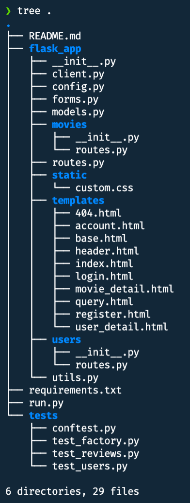

# Project 5: Untested Apps? No, Broken Apps.

**Assigned**: Week 9, March 30th, 2022

**Due**: Week 11, April 12th, 2022

**Late Deadline**: April 15th, 2022

## Description

This project is based partly off of your previous project. As the Flask docs
so elegantly say, "Something that is untested is broken." We're sorry
we have been making you all develop broken apps for the entire semester,
but you'll learn how to make actually-functional apps with this project.

This project has most of the functionality of project 4 implemented, excluding
profile pictures. The emphasis on this project is **testing** (and blueprints, 
to a lesser extent).

## Setup

The setup of your API key should be complete from project 3.

Activate your virtual environment (we recommend using the same one you've
used for other projects, you don't need a new one). Then to install
all necessary packages, run `pip3 install -r requirements.txt`

For this project we'll be using the
- `requests`
- `Flask`
- `Flask-MongoEngine`
- `Flask-WTF`
- `Flask-Bcrypt`
- `Flask-Login`
- `python-dotenv`
- `pytest`

libraries

## Project

This is the `p5/` directory structure

To run this project, stay in the `p5/` directory and use the `flask run`
command. This project is run the same way as project 4. The
application fully works as it is given.

In `__init__.py`, apps are now created by calling the
`create_app()` function. Optionally, a `test_config` parameter can be passed
in so that the application will be configured with the desired
settings for testing. 

We create the `db`, `login_manager`, and `movie_client` objects and
initialize them using the `init_app()` function of these extensions.

Then we register the `main` blueprint (you'll change this later) and set
a global 404 error handler function.

The configuration is loaded from `config.py`. Although we don't have many
configuration values for this project, this kind of pattern
is the best practice for when your apps might get more complicated and have lots of configuration values.

### routes.py

In this file, you'll notice that there is a `main` blueprint. This is the blueprint
that contains all of the routes, and it was registered to our application
in `__init__.py`. 

You have to reorganize the project to make it more modular. It doesn't make sense
to have the functions concerned with user management side by side with the
functions concerned with entering or viewing reviews.
So you'll see that we created two directories that
each have a `routes.py` inside of them. To complete
this part of the project, you'll need to

1. Create blueprints inside of `users.routes` and `movies.routes` named `users` and `movies`, respectively.
2. Put all user management view functions into the `users` blueprint. These are:
   - `register`,
   - `login`,
   - `account`,
   - `logout`
3. Put all other view functions into the `movies` blueprint. These are:
   - `index`
   - `query_results`
   - `movie_detail`
   - `user_detail`
4. Rename routes from `main.some_route` to `users.some_route` or `movies.
   some_route` as appropriate. These changes will need to happen in the template
   files and in the function bodies as needed.
5. Register these blueprints with the main `Flask` object.

### tests

In the `tests/` directory, you'll notice four files. The
`conftest.py` file is provided with everything fully implemented.
We'll go into detail about how this code works:

- `@pytest.fixture` indicates that the *return value* of the function will be
  passed as a parameter to any `test_*` function that has a parameter with
  the same name as the function. For example, we create the `app` fixture and we
  pass it in as a parameter to the `client` fixture further down in the code.
- `app()` configures the Flask application with custom testing settings, 
  clears the database, pushes an app context, and returns the app.
- `client()` returns a test client for the application
- `AuthActions` consists of convenience methods to help you register, login,
  and log out of your application. It's used in `auth()` below.
- `auth()` is a fixture that provides authentication actions.

The `test_factory.py` file is provided with implemented tests so you can see how we
test that our configuration values are properly set.

You'll have to implement some tests in `test_movies.py` and `test_users.py`.

`test_movies.py`
- Implement `test_search_input_validation(client, query, message)` with `pytest.mark.parametrize`
  - Test that with an empty query, you get the error "This field is required."
  - Test that with a very short string, you get the error "Too many results"
  - Test that with some gibberish (maybe a random string?) you get the error
    "Movie not found"
  - Test that with a string that's too long, you get the error
    "Field must be between 1 and 100 characters long."
- Implement `test_movie_review(client, auth)`
  - A beginning implementation is already provided to check if the movie detail page
    for the 'Guardians of the Galaxy' page will show up. The choice of this id is
    arbitrary, and you can change it to something else if you want.
  - Register and login
  - Submit a movie review with a randomly generated string (to make sure that
    you're adding a truly unique review)
  - Test that the review shows up on the page
  - Test that the review is saved in the database
- Implement `test_movie_review_redirects(client, movie_id, message)` with `pytest.mark.parametrize`
  - This test refers to navigating to movies at a certain `/movies/<movie_id>` url.
  - Test that with an empty movie_id, you get a status code of `404` and that you
    see the custom 404 page.
  - Test that with (1) a movie_id shorter than 9 characters, 
    (2) a movie_id exactly 9 characters (but an invalid id), and (3) a 
    movie_id longer than 9 characters, the request has a status code of 
    `302` and the error message "Incorrect IMDb ID" is displayed on the 
    page you're redirected to.
- Implement `test_movie_review_input_validation(client, auth, comment, message)` with `pytest.mark.parametrize`
  - This test checks whether the proper validation errors from `MovieReviewForm`
    are raised when you provide incorrect input.
  - Test that with an empty string, you get the error "This field is required"
  - Test that with (1) a string shorter than 5 characters and (2) a string
    longer than 500 characters, you get the error 
    "Field must be between 5 and 500 characters long."
    - **Hint:** `'a' * 10 == 'aaaaaaaaaa'`
  - You can use any movie id here, just make sure it's valid or your test will fail.

`test_users.py`
- Implement `test_login_input_validation(auth, username, password, message)` with `pytest.mark.parametrize`
  - Test that if you try to log in with an empty (1) username or (2) password, 
    you get the error "This field is required"
  - Test that when you successfully register but have (1) a bad username or (2)
    a bad password, you get the error message 
    "Login failed. Check your username and/or password"
- Implement `test_logout(client, auth)`
  - Register, login, check that you successfully logged in, and then logout, and
    check that you successfully logged out
- Implement `test_change_username(client, auth)`
  - Test that the account page loads successfully and that you can successfully
    change the username of the logged-in user. 
  - Test that the new username shows up on the account page
  - Test that the new username change is reflected in the database
- Implement `test_change_username_taken(client, auth)`
  - Test that if we try to change the username to a different user's username,
    then we get the error message "That username is already taken"
- Implement `test_change_username_input_validation(client, auth, new_username)`
  - Test that if we pass in an empty string, we get the error
    "This field is required."
  - Test that if we pass in a string that's too long, we get the error 
    "Field must be between 1 and 40 characters long."

There are a total of 21 tests. Each case in the input validation tests counts as 
a different test.

For the input validation tests, you have to figure out what to put inside the
function. Then you can adjust the parameters being passed in according
to the specifications above, and you will cover all cases for
validating that input!

## Testing

### blueprints

Try to perform all of the usual functions on the website, such as registration,
login, going to your account, changing your username, 
performing movie queries, posting reviews, going into your user detail page,
etc. Also try navigating to the account page when you're not logged in,
or try some other bad actions to make sure that your blueprints are working.

If you implement the tests part of the project first, you can probably
avoid checking that your blueprints are correct manually.

### tests

Make sure you've covered every test case as detailed above. When
you're in the `p5/` directory, run `python -m pytest`.

This will say "4 failed, 9 passed, 5 skipped" when you start your project.
By the end, it should be "30 passed".

## Submission

For submission, submit the zipped `p5/` directory.
**The directory, along with its contents, should be zipped, not the contents of the directory.**
In other words, when we unzip your file, we should see the `p5/` directory. If you
have any questions on how to submit, please contact us.

If you don't submit according to the instructions above, you may lose **up to 25%** of your
score on this project.

Also make sure that you don't include your virtual environment in the submission.
It makes your submissions much larger, and we don't need them
in order to grade.

If you include your virtual environment, you may lose **up to 25%** of your
score on this project.

## Grading

If you don't use MongoDB or don't use the packages mentioned in
[Setup](#setup), then you will get a zero on this project.

This will be graded on (1) correctness and (2) robustness

You will have to implement 21 tests. There will be 30 tests in total
and each will be worth 5 points for a total of 150 points
for writing tests. 45 of these points are given in the tests that
were already passing when you got this project.

Every test that passes gives you 5 points.

For blueprints, you will get
- 5 points for creating each blueprint (2 total)
- 5 points for correctly separating each of the 8 functions into the two blueprints.
  If we get an error related to your view functions being improperly configured
  in the blueprints, then you'll lose points.

In total, there are 200 points.

**Robustness:**

Refer to the syllabus for the robustness requirement for all projects.
The syllabus has been updated with this information, since
it will be common to all projects.
